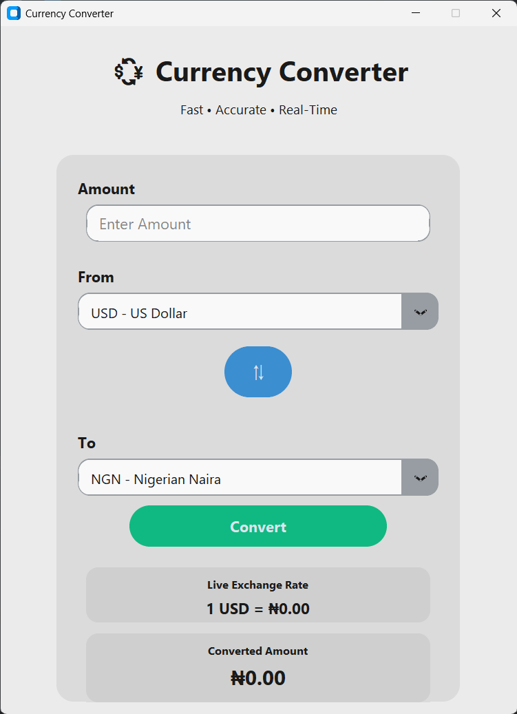
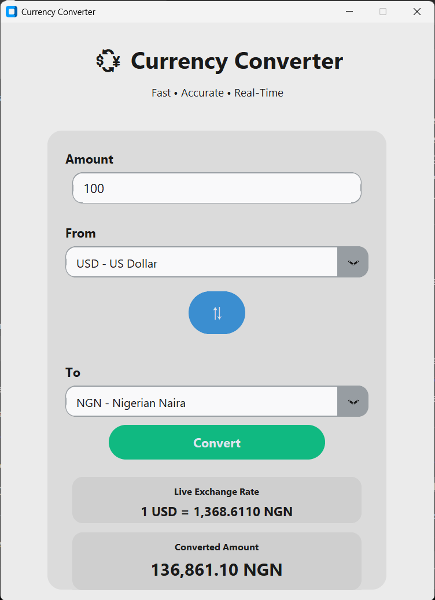
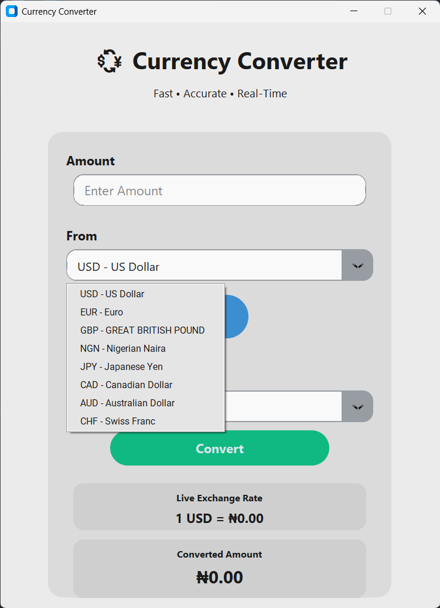

# 💱 Python Currency Converter

A desktop Currency Converter application built with Python and Custom Tkinter that converts currencies in real time using the ExchangeRate-API.

The application provides a simple graphical interface where users can select currencies, enter an amount, and instantly view the converted value using live exchange rates.

---

## Features

- Real-time currency conversion
- ExchangeRate-API integration
- Easy-to-use Custom Tkinter interface
- Currency selection dropdowns
- Recent conversion history
- Input validation
- Error handling for API failures
- Clean modular project structure

---

## Technologies Used

- Python
- Custom Tkinter
- Requests
- ExchangeRate-API
- JSON

---

## Project Structure

```
main.py
currency_gui.py
currency_api.py
config.py
recent_conversions.json
requirements.txt
assets/
README.md
```

---

## Running the Application

### Install dependencies

```bash
pip install -r requirements.txt
```

### Run

```bash
python main.py
```

---

## Screenshots

### Home Screen



### Conversion Result



### Different Currency



---

## Future Improvements

- Dark Mode
- Light Mode
- Country flags
- Background themes
- Offline conversion mode
- Favorite currencies
- Exchange rate charts

---

## Author

**Edet Simon**

Python Developer | Backend Developer | Bot Developer